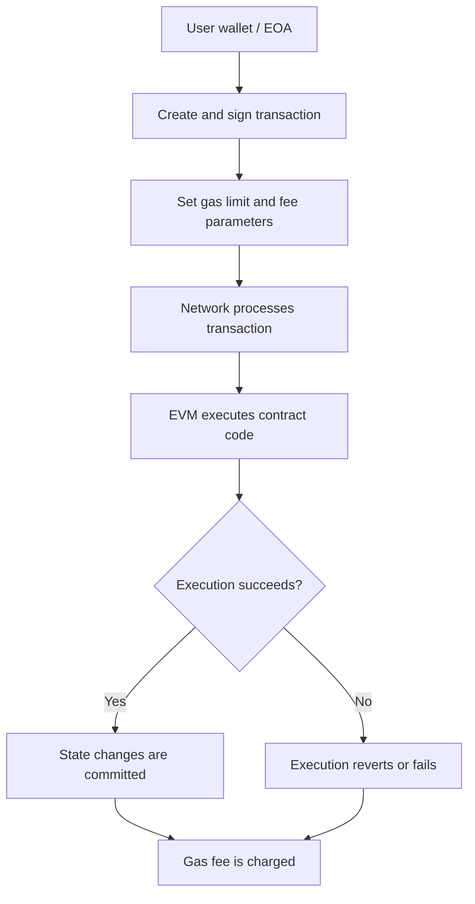

# Ethereum Architecture: EVM, Gas, and Accounts

## 1. What Is the EVM?

The Ethereum Virtual Machine (EVM) is the execution environment for smart contracts on Ethereum. It provides a shared set of rules for executing contract code and updating blockchain state.

**AZARS analogy:** Imagine a shared financial processing engine. Every participant follows the same execution rules, so a smart contract does not depend on one company's private server to determine its result.

## 2. What Is Gas?

Gas measures the computational work required to execute an Ethereum transaction or smart contract operation.

A useful analogy is fuel in a car:

* **Gas used:** The amount of computational work performed.
* **Gas limit:** The maximum amount of gas the transaction is allowed to consume.
* **Gas price:** The amount paid per unit of gas.
* **Transaction fee:** Generally calculated from gas used and the effective price paid per unit.

A transaction that runs out of gas during execution fails. Gas already consumed is generally still charged, so the transaction sender can lose the fee even though the intended state change does not succeed.

## 3. Ethereum Accounts

Ethereum has two main account types:

* **Externally Owned Account (EOA):** Controlled by a private key, commonly accessed through a wallet such as MetaMask.
* **Contract Account:** Associated with deployed smart-contract code and controlled by that code's execution rules.

A user can initiate a transaction from a wallet to transfer ETH or interact with a deployed contract.

## 4. Simple Transaction Flow

## 5. Why Does Gas Matter for AZARS?

If AZARS later uses smart contracts to record a verified action, manage access to an on-chain process, or execute a financial rule, each transaction may require gas.

Before submitting a transaction, the application should estimate its cost and check whether the user's gas limit and available balance are sufficient. The estimate is not a guarantee: actual execution costs and network fees can change.

## 6. Key Takeaways

* The EVM executes compatible smart-contract instructions.
* Gas accounts for computational work and discourages unlimited resource consumption.
* The gas limit caps the execution budget; it does not guarantee success.
* EOAs and contract accounts have different roles.
* This document describes concepts only; it does not implement a contract or provide investment advice.

**Reference:** Ethereum.org — [Ethereum Virtual Machine (EVM)](https://ethereum.org/en/developers/docs/evm/).
